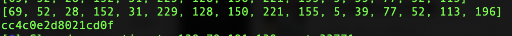
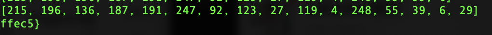

### aes

这是一道典型的Padding Oracle攻击，本菜鸡想着应该很快就会被秒了的，但是不知道为什么只有两个师傅做了Orz...原理可以参考网上的各种关于padding oracle attack的文章，讲的都比我清楚，我就不献丑了，比如说https://www.freebuf.com/articles/database/151167.html

```
对于第一块 plaintext[0] = middle[0] ^ iv[0]
对于第二块 plaintext[0] = middle[0] ^ 第一组密文[0]
对于第三块 plaintext[0] = middle[0] ^ 第二组密文[0]
```

exp如下

```python
# -*- coding:utf8 -*-
import base64
import string
import hashlib
from pwn import *

secret = "pxIALhdgqbmusNcu+3gEI3tgQlTNeX0RcVb9tbGCzt0zw5GZEBeQAbE8ybRUTtRW"
secret1 = base64.b64decode(secret)[0:16]
secret2 = base64.b64decode(secret)[16:32]
secret3 = base64.b64decode(secret)[32:]
p = remote('183.129.189.60',10036)

def proof(salt,res):
    print "Solving......"
    dict = string.digits + string.ascii_letters
    for i in dict:
        for j in dict:
            for a in dict:
                for b in dict:
                    for c in dict:
                        code = i + j + a + b + c
                        payload = code + salt
                        if hashlib.md5(payload).hexdigest()[0:5] == res:
                            print "[+] md5 has been found"
                            return code

p.recvuntil("Please find a string that md5(str + ")
salt = p.recv(4)
p.recvuntil(")[0:5] == ")
res = p.recv(5)
p.recvuntil("[>] Give me xxxxx: ")
code = proof(salt,res)
p.sendline(code)

middle = []
padding = ''

for x in xrange(1,17):
    for y in xrange(0,256):
        IV = "\x00" * (16-x) + chr(y) + padding
        p.recvuntil("[>] Please input your option: ")
        p.sendline("d")
        p.recvuntil("[>] IV: ")
        p.sendline(base64.b64encode(IV))
        p.recvuntil("[>] Data: ")
        p.sendline(base64.b64encode(secret3))
        res = p.recvuntil("\n")
        if 'done' in res:
            middle.append(y ^ x)
            print middle
            padding = ''
            for z in middle:
                padding = chr((x+1) ^ z) + padding
            break


flag = ""
for x,y in zip(middle,secret2[::-1]):
    # first block
    # flag += chr(x ^ ord('A'))
    # other block
    flag += chr(x ^ ord(y))
print flag[::-1]

# GWHT{5befac3acd0cc4c0e2d8021cd0fffec5}
```






