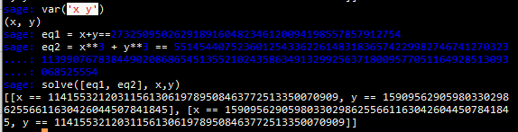
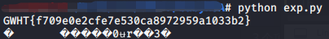

## babyRSA
这道题其实用yafu或者直接开方分解出p和q以后，剩下的就只是解方程而已  
中间的解方程用sage解  

完整exp  
```python
import hashlib
import libnum
import gmpy2
from Crypto.Util.number import *

N = 636585149594574746909030160182690866222909256464847291783000651837227921337237899651287943597773270944384034858925295744880727101606841413640006527614873110651410155893776548737823152943797884729130149758279127430044739254000426610922834573094957082589539445610828279428814524313491262061930512829074466232633130599104490893572093943832740301809630847541592548921200288222432789208650949937638303429456468889100192613859073752923812454212239908948930178355331390933536771065791817643978763045030833712326162883810638120029378337092938662174119747687899484603628344079493556601422498405360731958162719296160584042671057160241284852522913676264596201906163
m1 = 90009974341452243216986938028371257528604943208941176518717463554774967878152694586469377765296113165659498726012712288670458884373971419842750929287658640266219686646956929872115782173093979742958745121671928568709468526098715927189829600497283118051641107305128852697032053368115181216069626606165503465125725204875578701237789292966211824002761481815276666236869005129138862782476859103086726091860497614883282949955023222414333243193268564781621699870412557822404381213804026685831221430728290755597819259339616650158674713248841654338515199405532003173732520457813901170264713085107077001478083341339002069870585378257051150217511755761491021553239
m2 = 487443985757405173426628188375657117604235507936967522993257972108872283698305238454465723214226871414276788912058186197039821242912736742824080627680971802511206914394672159240206910735850651999316100014691067295708138639363203596244693995562780286637116394738250774129759021080197323724805414668042318806010652814405078769738548913675466181551005527065309515364950610137206393257148357659666687091662749848560225453826362271704292692847596339533229088038820532086109421158575841077601268713175097874083536249006018948789413238783922845633494023608865256071962856581229890043896939025613600564283391329331452199062858930374565991634191495137939574539546
e = 0x10001

p = gmpy2.iroot(N, 2)[0]
for i in range(10000):
	if p*(N/p) == N:
		q = N/p
		break
	p = p - 1

phi  = (p-1)*(q-1)
d = gmpy2.invert(e, phi)
c1 = pow(m1, d, N)
c2 = pow(m2, d, N)

c3 = c2/c1
# f1 + f2  = c1
# f1**3 + f2**3 = c2

c3 = 2018124390758744579176881760393912432855047177830525334114351200861828082292382837553703201

x = 1141553212031156130619789508463772513350070909
y = 1590956290598033029862556611630426044507841845

print long_to_bytes(y)+long_to_bytes(x)
print libnum.n2s(0xf709e0e2cfe7e530ca8972959a1033b2)
```
