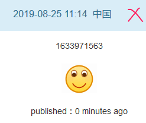
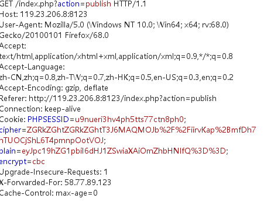
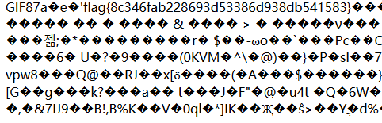

## blog


注册登陆，尝试文件包含发现提示只有admin能用


然后上传文件发现文件名显示在index页面中 



于是fuzz一下，发现有空格，select等过滤于是简单的绕过一下
```
'+(selselectect(conv(substr(hex((selselectect(GROGROUPUP_CONCONCATCAT(password))frfromom(byte_user))),1,8),16,10)))+'
```
得到密码的一段16进制后在转10进制的数，转码后拼接起来，md5解密一下获得admin的密码



登录admin再次尝试文件包含，但只能包含图片文件


于是上传图片但提示非法ip，然后抓包发现提示了CBC加密同时给了明文与密文的base64加密值，于是解码发现明文为`{"is_admin":true,"ip":false}`，于是进行CBC翻转将ip的值转为1



放入cookie然后进行图片上传，发现传上去的图片进过了二次渲染。于是修改文件头部非文件头部分，写入`system('cat \flag');`，再通过action的文件包含执行获取flag